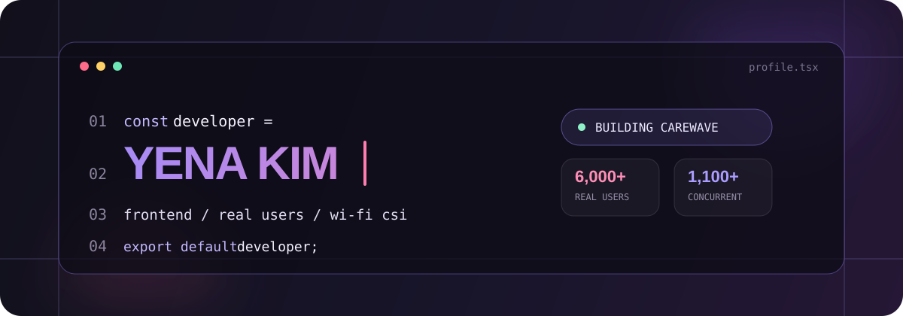

  

 

### 안녕하세요, 김예나입니다.

React와 TypeScript로 **사람들이 실제로 쓰는 화면**을 만듭니다.  
경영학과 디지털소프트웨어공학을 함께 공부했고, 요즘은 ESP32-S3와 Wi-Fi CSI까지 개발 범위를 넓히고 있습니다.

`사용자 6,000+`　`동시 접속 1,100+`　`프론트엔드 운영진`　`CSI 모델 개발 중`

---

## work.log

<table>
  <thead>
    <tr>
      <th width="90">YEAR</th>
      <th width="270">ACTIVITY</th>
      <th>WHAT I DID</th>
    </tr>
  </thead>
  <tbody>
    <tr>
      <td align="center"><b>2025</b></td>
      <td>멋쟁이사자처럼 13기</td>
      <td>프론트엔드 아기사자 · 중앙해커톤 · 데모데이</td>
    </tr>
    <tr>
      <td align="center" rowspan="5"><b>2026</b></td>
      <td>멋쟁이사자처럼 14기</td>
      <td>프론트엔드 운영진 · 아기사자 교육 및 운영</td>
    </tr>
    <tr>
      <td>근화제 축제 웹사이트</td>
      <td>프론트엔드 개발 · 사용자 <b>6,000+</b> · 동시 접속자 <b>1,100+</b></td>
    </tr>
    <tr>
      <td>중앙해커톤</td>
      <td>React·TypeScript 기반 서비스 구현 및 배포</td>
    </tr>
    <tr>
      <td>여기톤</td>
      <td>프론트엔드 개발 참여</td>
    </tr>
    <tr>
      <td>졸업프로젝트 CareWave</td>
      <td>ESP32-S3 펌웨어·프로비저닝·CSI 데이터 수집·행동 분류 모델</td>
    </tr>
  </tbody>
</table>

---

## selected.work

<table>
  <tr>
    <td width="50%" valign="top">
      <h3>01 — CareWave 📡</h3>
      
<b>카메라 없는 비접촉 행동 감지 시스템</b>

      
ESP32-S3 송수신 보드와 Wi-Fi CSI를 이용해 서기·눕기·낙상을 분류합니다.

      <code>ESP32-S3</code> <code>Python</code> <code>Wi-Fi CSI</code>
        
      펌웨어 · 프로비저닝 · 다중 RX 수집 · CSI Stream
    </td>
    <td width="50%" valign="top">
      <h3>02 — HALE 🫧</h3>
      
<b>맞춤형 피부 관리 루틴 서비스</b>

      
피부 상태에 따라 집중·데일리 케어 루틴과 제품을 연결합니다.

      <code>React</code> <code>TypeScript</code> 
        
      사용자 플로우 · REST API · 상태 관리 
    </td>
  </tr>
  <tr>
    <td width="50%" valign="top">
      <h3>03 — 근화제 🌸</h3>
      
<b>교내 축제 실시간 정보 서비스</b>

      
행사 기간 6,000명 이상이 사용한 축제 웹사이트의 프론트엔드를 개발했습니다.

      <code>React</code> <code>TypeScript</code> <code>Vite</code>
        
      실서비스 운영 · 트래픽 대응 · 기능 개선
    </td>
    <td width="50%" valign="middle" align="center">
      <h3>more to come...</h3>
      
작게 시작해도 <b>실제로 작동하는 결과</b>까지 만듭니다.

      <a href="https://github.com/aney0714?tab=repositories">view repositories →</a>
    </td>
  </tr>
</table>

<!-- 프로젝트 저장소가 공개되면 각 카드 제목에 링크를 연결하세요. -->

---

## toolbox

  

  
  
  

---

## github.output

  
  

 

  <a href="https://github.com/aney0714">github.com/aney0714</a>

